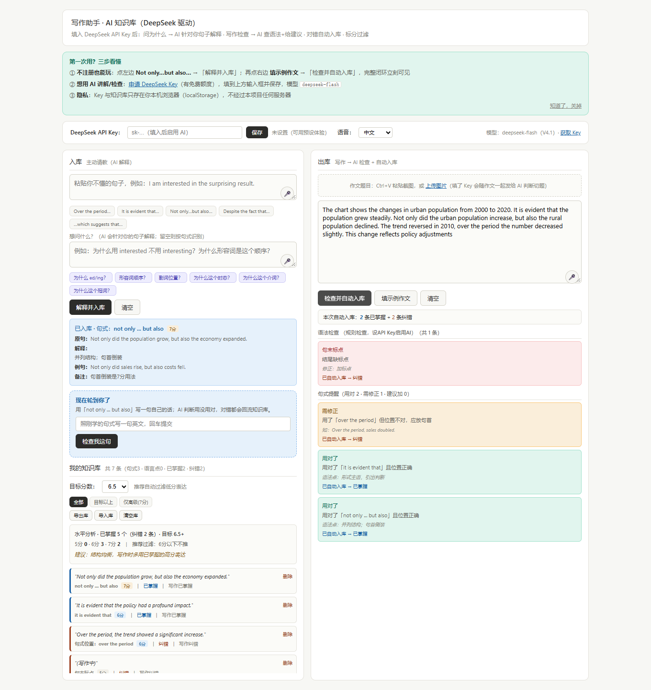

# Writing Coach · AI 英语写作学习工具

把学过的表达带进写作：**学习 → 仿写 → 判断 → 写作 → 反馈回流知识库**。

[打开在线 Demo](https://kafuka046-art.github.io/writing-coach/) · [查看四个作品与本人贡献](docs/PORTFOLIO.md)



## 为什么做

学过一个句式，并不代表写作时能用对。这个工具将句子讲解、仿写、作文检查和个人知识库放在同一流程中，让正确用法和需要纠正的表达都能回到后续学习。

## 已有功能

| 环节 | 当前行为 |
| --- | --- |
| 学习 | 输入句子和具体问题；AI 根据问题输出 3–6 段讲解，默认控制在 400 字以内，并给出仿写任务 |
| 仿写 | 在讲解卡下输入自己的句子，检查目标句式是否使用正确 |
| 反馈回流 | 保存仿写和作文反馈；同一句式的仿写记录去重，再练对后可更新原纠错记录 |
| 写作 | 输入作文，检查语法和已学句式，将已掌握与纠错结果回流知识库 |
| 资料管理 | 按目标能力段筛选表达，本地保存知识库和草稿，支持 JSON 导入与导出 |
| 输入辅助 | 语音输入，以及作文题目图片粘贴、上传入口 |

没有 API Key 时使用预设内容与本地规则演示；输入自己的 DeepSeek API Key 后可调用 AI。预设判断用于体验流程，不能替代真实语言能力评估。图片识别效果取决于所调用模型的能力。

## 本人贡献与验证

本人负责需求分析、功能清单和产品设计，借助 AI 实现前端及 Node.js 本地代理，并进行功能验证和问题修复。

- 已确认的试用记录：**5 人试用、6 条反馈、3 版迭代**。
- 已有仿写闭环回归测试，覆盖 JSON 解析、回流去重、纠错更新和无 Key 的本地演示路径。
- 上述记录是小范围产品迭代证据，不代表大规模用户采用或学习效果实测。

## 怎么体验

### 在线

打开 [GitHub Pages Demo](https://kafuka046-art.github.io/writing-coach/)。先选择一个预设句式，点击“解释并入库”，完成一次仿写；再使用示例作文体验检查与反馈回流。

需要真实 AI 讲解时，在页面输入并保存自己的 DeepSeek API Key。模型服务可能收费，按服务方当前规则使用。

### 本地

```bash
git clone https://github.com/kafuka046-art/writing-coach.git
cd writing-coach
node proxy-server.js
```

浏览器打开 `http://localhost:8768/`。本地代理静态服务与 AI 请求；静态托管版本由浏览器直接请求模型服务。

### 运行现有测试

```bash
node tests/closed-loop.test.js
```

## 数据与边界

知识库、作文草稿、目标分数和 API Key 存在当前浏览器的 `localStorage` 中。AI 模式下，相关输入会发送给模型服务；本地模式经本机代理转发。更换设备或清除浏览器数据前，应导出备份。

句式等级和检查反馈是学习辅助，不是官方雅思评分。语言点条目参与作文扫描、流式输出、请求超时重试和更完整的测试覆盖仍待完善。

## 目录

```text
index.html             单文件前端
proxy-server.js        本地静态服务与代理
start.bat / start.sh   启动脚本
tests/                 仿写闭环回归测试
docs/                  项目说明、演示资料与作品概览
```

## License

MIT，沿用仓库已有 LICENSE。
